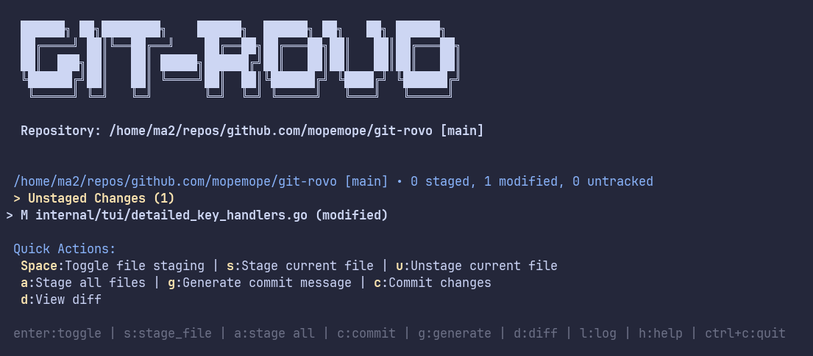
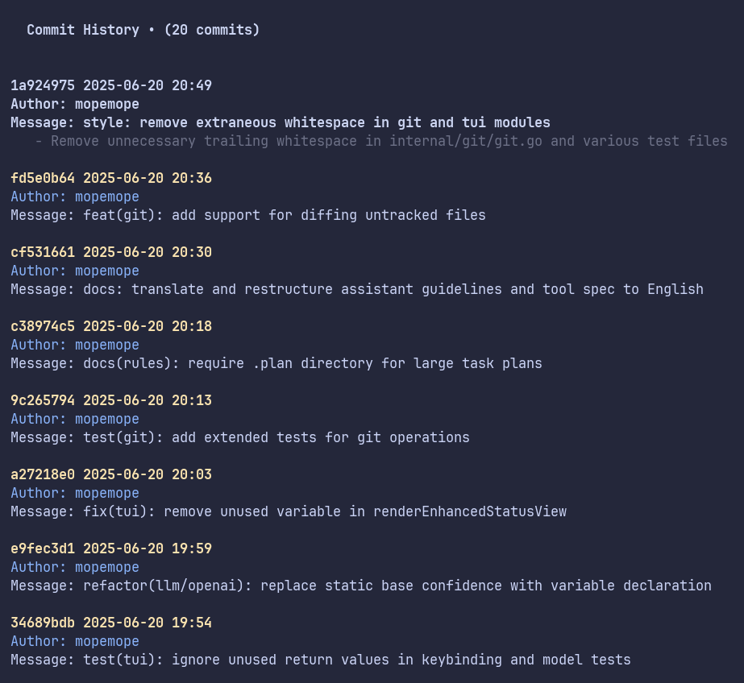
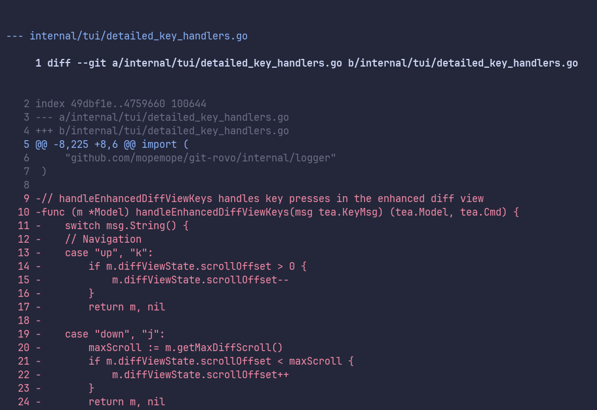
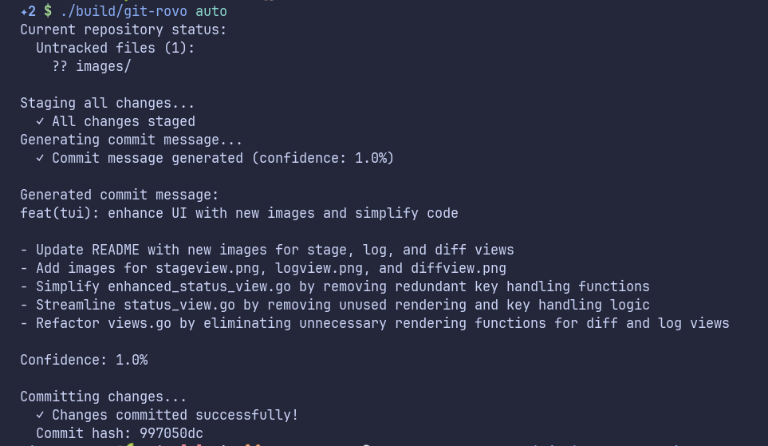

# GIT-ROVO

A TUI-based Git commit assistant with LLM-powered message generation

## Overview

`git-rovo` is a terminal user interface (TUI) based Git commit assistant that uses Large Language Models (LLM) to automatically generate Conventional Commits compliant commit messages. It provides an intuitive interface for Git operations without requiring an external editor.









## Key Features

### 🎨 Intuitive TUI Interface
- Modern terminal UI built with [Bubble Tea](https://github.com/charmbracelet/bubbletea)
- Inspired by Emacs [magit](https://magit.vc/) and [gitu](https://github.com/altsem/gitu)
- Rich keyboard shortcuts for efficient operation
- File organization by sections (staged/unstaged/untracked)
- Real-time diff display with scrolling and syntax highlighting
- Multiple view modes: Status, Diff, Log, and Help

### 🤖 LLM-powered Commit Message Generation
- Analyzes Git diffs and generates appropriate commit messages
- Full Conventional Commits specification compliance
- OpenAI GPT integration with multiple model support:
  - GPT-4o (latest and most capable)
  - GPT-4o-mini (fast and cost-effective)
  - GPT-4-turbo
  - GPT-4
  - GPT-3.5-turbo
- Multi-language support (English/Japanese)
- Confidence scoring for generated messages
- Customizable temperature and token limits

### ⚡ Comprehensive Git Operations
- Interactive file staging and unstaging
- Commit history browsing with detailed views
- Diff viewing with multiple display modes
- One-command auto-commit workflow
- Comprehensive logging of all Git operations
- Support for both staged and untracked file diffs

### 🔧 Advanced Configuration
- TOML-based configuration system
- Environment variable overrides
- Customizable key bindings
- Flexible logging levels and output
- Theme customization support

## Installation

### Prerequisites

- **Git**: Version 2.0 or higher
- **Go**: Version 1.24 or higher (for building from source)
- **OpenAI API Key**: Required for LLM functionality

### From Binary Release

```bash
# Download the latest release
curl -L https://github.com/mopemope/git-rovo/releases/latest/download/git-rovo-linux-amd64.tar.gz | tar xz
sudo mv git-rovo /usr/local/bin/

# Verify installation
git-rovo version
```

### Build from Source

```bash
# Clone the repository
git clone https://github.com/mopemope/git-rovo.git
cd git-rovo

# Install dependencies and build
make deps
make build

# Install to ~/.local/bin/
make install

# Verify installation
git-rovo version
```

## Quick Start

### 1. Initialize Configuration

```bash
# Interactive configuration setup
git-rovo config init
```

This will prompt you for:
- OpenAI API Key
- Preferred language (english/japanese)
- OpenAI model selection
- Other preferences

### 2. Set Up OpenAI API Key

Get your API key from [OpenAI Platform](https://platform.openai.com/):

```bash
# Set environment variable (recommended)
export OPENAI_API_KEY="sk-proj-xxxxxxxxxxxxxxxx"

# Or use git-rovo specific variable
export GIT_ROVO_OPENAI_API_KEY="sk-proj-xxxxxxxxxxxxxxxx"
```

### 3. Verify Configuration

```bash
git-rovo config show
```

### 4. Start Using git-rovo

```bash
# In any Git repository
cd /path/to/your/git/repository
git-rovo

# Or use auto-commit mode
git-rovo auto
```

## Usage Modes

### Interactive TUI Mode (Default)

Launch the full TUI interface:

```bash
git-rovo
```

**Key Bindings:**
- `q`, `Ctrl+C`: Quit application
- `h`: Show help
- `r`: Refresh current view
- `s`: Switch to status view
- `d`: Switch to diff view
- `l`: Switch to log view

**Status View:**
- `↑/k`, `↓/j`: Navigate files
- `Space/Enter`: Toggle file staging
- `a`: Stage all files
- `A`: Unstage all files
- `g`: Generate commit message
- `c`: Execute commit
- `C`: Quick commit (generate + commit)

**Diff View:**
- `↑/k`, `↓/j`: Scroll content
- `←/h`, `→/l`: Navigate between files
- `m`: Cycle diff display modes
- `n`: Toggle line numbers
- `w`: Toggle line wrapping

**Log View:**
- `↑/k`, `↓/j`: Navigate commits
- `Enter`: Show commit details
- `d`: Show commit diff

### Auto-Commit Mode

Automatically stage all changes, generate commit message, and commit:

```bash
# Basic auto-commit
git-rovo auto

# Preview what would be done
git-rovo auto --dry-run
```

This performs:
1. `git add .` (stage all changes)
2. Generate commit message with LLM
3. `git commit -m "<generated message>"`

## Configuration

### Configuration File Location

Default: `~/.config/git-rovo/config.toml`

### Configuration Structure

```toml
[llm]
provider = "openai"
language = "english"  # or "japanese"

[llm.openai]
api_key = "your-openai-api-key"  # Optional if using env vars
model = "gpt-4o-mini"
temperature = 0.7
max_tokens = 1000

[git]
show_untracked = true

[ui]
theme = "default"

[ui.key_bindings]
# Custom key bindings (optional)
# quit = "x"
# generate_message = "m"

[logger]
level = "info"  # debug, info, warn, error
file_path = "~/.local/share/git-rovo/git-rovo.log"
```

### Environment Variables

- `OPENAI_API_KEY`: OpenAI API key
- `GIT_ROVO_OPENAI_API_KEY`: git-rovo specific API key (overrides OPENAI_API_KEY)
- `GIT_ROVO_OPENAI_MODEL`: Override model selection
- `GIT_ROVO_LANGUAGE`: Override language setting
- `GIT_ROVO_LOG_LEVEL`: Override log level

### Configuration Commands

```bash
# Show current configuration
git-rovo config show

# Reinitialize configuration
git-rovo config init

# Use custom config file
git-rovo --config /path/to/config.toml
```

## Project Architecture

### Core Components

- **`cmd/git-rovo/`**: Main application entry point and CLI commands
- **`internal/config/`**: Configuration management (TOML-based)
- **`internal/git/`**: Git operations wrapper with comprehensive diff support
- **`internal/llm/`**: LLM provider abstraction with OpenAI implementation
- **`internal/tui/`**: Terminal user interface components
- **`internal/logger/`**: Structured logging system

### Technical Stack

- **Language**: Go 1.24
- **TUI Framework**: [Bubble Tea](https://github.com/charmbracelet/bubbletea)
- **Styling**: [Lipgloss](https://github.com/charmbracelet/lipgloss)
- **CLI Framework**: [Cobra](https://github.com/spf13/cobra)
- **Configuration**: [TOML](https://github.com/BurntSushi/toml)
- **LLM Integration**: [go-openai](https://github.com/sashabaranov/go-openai)

### Project Statistics

- **Total Go Files**: 34 files (~9,257 lines of code)
- **Test Files**: 15 files (~4,021 lines of test code)
- **Test Coverage**: Comprehensive unit and integration tests
- **Dependencies**: Minimal, well-maintained dependencies

## Development

### Development Setup

```bash
# Clone and setup
git clone https://github.com/mopemope/git-rovo.git
cd git-rovo

# Install development dependencies
make dev-setup

# Run tests
make test

# Run with coverage
make test-coverage

# Lint code
make lint

# Build
make build
```

### Available Make Targets

```bash
make help          # Show all available targets
make build         # Build the application
make test          # Run all tests
make test-coverage # Run tests with coverage
make lint          # Run linter
make clean         # Clean build artifacts
make install       # Install to ~/.local/bin/
make dev-setup     # Setup development environment
```

### Testing

The project includes comprehensive testing:

- **Unit Tests**: Individual component testing
- **Integration Tests**: End-to-end workflow testing
- **Mock Providers**: LLM provider testing without API calls

```bash
# Run all tests
make test

# Run specific test package
go test ./internal/git/...

# Run with verbose output
go test -v ./...
```

## Troubleshooting

### Common Issues

#### Configuration File Not Found
```bash
# Check configuration
git-rovo config show

# Recreate configuration
git-rovo config init
```

#### OpenAI API Key Issues
```bash
# Verify API key is set
echo $OPENAI_API_KEY

# Check configuration
git-rovo config show
```

#### Not a Git Repository
```bash
# Ensure you're in a Git repository
git status

# Or specify working directory
git-rovo --work-dir /path/to/git/repo
```

### Debug Mode

```bash
# Run with debug logging
git-rovo --log-level debug

# Check log file
tail -f ~/.local/share/git-rovo/git-rovo.log
```

## Contributing

We welcome contributions! Please see our development setup above.

### Code Style

- Follow Go best practices
- Add tests for new features
- Update documentation
- Run `make lint` before submitting

## License

MIT License - see [LICENSE](LICENSE) file for details.

## Acknowledgments

- Inspired by [magit](https://magit.vc/) and [gitu](https://github.com/altsem/gitu)
- Built with [Bubble Tea](https://github.com/charmbracelet/bubbletea) TUI framework
- Uses [Conventional Commits](https://www.conventionalcommits.org/) specification
